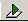

# Micrium/Renesas AWS IoT Getting Started

## Kit Contents

The Renesas RX63N AWS IoT Starter Kit has the following contents:
* Renesas YRDKRX63N board
* USB to mini-USB Cable
* Preloaded with Micrium's Smart Home Gateway Demo


## Smart Home Gateway Overview

The Smart Home Gateway simulation shows how the RX63N could be used as a gateway device to handle the interaction between appliances and temperature sensors to AWS IoT. The idea is an appliance or temperature sensor may have Personal Area Network connection (Bluetooth, ZigBee, Wireless USB, etc.) instead of a Local Area Network connection that provides a connection to the internet. This gateway would be the connection point all of the devices on the PAN to connect to the internet. In this simulation the PAN is simulated by the buttons and potentiometer on the YRDKRX63N. 

The connection between the YRDKRX63N and AWS IoT is done via a protocol call MQTT. More information on MQTT can be found on the AWS IoT website, as well as [here](http://www.mqtt.org).

The Smart Home Gateway has a few different components to it. Currently two features are implemented:
* Appliances
* Temperature sensors
In the future the ability to trigger alarms based on the temperature sensor values will be implemented, as well as more control over how often messages are sent. 

### Appliances
The Smart Home Gateway simulation has three apliances: Dishwasher, Lamp and a Dryer. As shown in the image above you can scroll through the appliances and change their state using Switch 1 and Switch 2 on the YRDKRX63N. Anytime an appliance’s state is changed a MQTT message is immediatley published to AWS IoT. 


### Temperature Sensors
The Smart Home Gateway simulation also has three temperature sensors: Kitchen, Family Room and Garage. You can change the temperature sensor using Switch 3, and you can use the potentiometer to change the actual temperature value. Similar to the appliances, any time a temperature value is changed it is immediately published to AWS IoT.


## Prerequisites

In order to run the Smart Home Gateway Demo on your own AWS account you need the following:
* AWS account. Click [here](https://aws.amazon.com) to create an account.
* IAR Embedded Workbench for RX<sup>1</sup>. A free 30-day trial can be obtained [here](https://www.iar.com/iar-embedded-workbench/renesas/rx).
* OpenSSL installed on your machine. Downloads available for [Win](https://www.openssl.org/community/binaries.html), [OS X](http://apple.stackexchange.com/questions/126830/how-to-upgrade-openssl-in-os-x) and Linux.
* Bin2Header python script. Download [here](http://sourceforge.net/projects/bin2header/).
* Contact Micrium [here](http://www.micrium.com/aws-iot-starter-kit) to obtain the Smart Home Gateway software.

<sup>1</sup>IAR is only available on Windows. 


## Importing and compiling the Smart Home Gateway project

1. Import the Smart Home Gateway project into IAR
    * Navigate to File -> Open -> Workspace

    * From the top of the RX63N project folder, open the .eww file located at:
    

2. Right click on the project name `OS3-MQTT-SSL - FLASH` then click `Rebuild All`:


3. After the project finishes building, plug in your ethernet cable to the YRDKRX63N, and then plug in the USB to the J-Link USB as shown below.


4. Click the Download and Debug button . If prompted to upgrade the firmware or setup the hardware, click ok.

5. Once the screen has changed to the debugging view and it pauses with `main()` highlighted, click to Go button in the top left corner to run the program:


## Downloading and converting X.509 certificates from AWS IoT

AWS IoT requires every device that connects to provide a signed X.509 certificate in order to connect. For the Smart Home Gateway to connect we use [Micrium's TCP/IP stack](http://micrium.com/rtos/uctcpip/overview/) and [Mocana's NanoSSL stack](https://www.mocana.com/iot-security/nanossl) to connect directly to AWS IoT.


1. Generate a certificate in AWS IoT
    * Navigate to [AWS IoT](https://aws.amazon.com/iot). Log in using your AWS account.
        
    * Click on the `+ Create a resource` and then on `Create a certificate`:
    
        
    * If you have a CSR you'd like signed, now is the time you can upload one otherwise click `1-Click Certificate Create`. This will provide you with a certificate, public key and private key. You should download all three of them.
        
2. Download the root CA certificate file

    The secure connection between AWS IoT and the RX63N requires Amazon to send us a certificate in addition to us sending Amazon a certificate. In order for us to validate the certificate Amazon sends us we need to hae a root certificate to validate the certificate against. The root certificate in this case is signed by Symantec and can be downloaded from [here](https://www.symantec.com/content/en/us/enterprise/verisign/roots/VeriSign-Class%203-Public-Primary-Certification-Authority-G5.pem). You should save this file to the same directory as the keys and certificate from Amazon as it will also have to be converted to the correct format. 

3. Activate the certificate and add a policy

    More detailed information on this can be found in AWS IoT's documentation [here](http://docs.aws.amazon.com/iot/latest/developerguide/what-is-aws-iot.html). 
    * Click on the checkbox under your certificate, then under the actions dropdown click activate.

    * Go back up to the `+ Create a resource` at the top and click on `Create a policy`. For simplification of this getting started guide we're creating a polciy that allows the certificate full access to all of AWS IoT's features. Fill out the policy form with the following paramters:
        * Name: PubSubToAnyTopic
        * Action: iot.\*
        * Resource: \*


    * Go back and click the checkbox on the certificate you created. On the Actions dropdown click `Attach a policy`. Enter the name of your policy (PubSubToAnyTopic). 

4. Convert the certificate to a header file

    In order for Mocana's NanoSSL library to be able to use the certificates from Amazon and Symantec we need to convert them from ASCII (PEM) to binary (DER). Once we have our binary certificates we will create three array's that will be loaded into our Smart Home Gateway project. 
    * In a terminal window, navigate to the directory that has the certificates and keys. 

    * First convert the two PEM certificates (AWS IoT cert and root CA) to DER using OpenSSL:
    ```
    openssl x509 -outform der -in rootCA.pem -out rootCA.der
    openssl x509 -outform der -in AWSIoT.pem -out AWSIoT.der
    ```

    * Next convert the private key to DER format as well using OpenSSL:
    ```
    openssl rsa -outform der -in privkey.pem -out privkey.der
    ```
