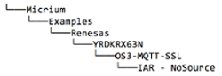

# Micrium/Renesas AWS IoT Getting Started

## Kit Contents

The Renesas RX63N AWS IoT Starter Kit has the following contents:
* Renesas YRDKRX63N board
* USB to mini-USB Cable
* Preloaded with Micrium's Smart Home Gateway Demo

## Smart Home Gateway Overview

The Smart Home Gateway simulation shows how the RX63N could be used as a gateway device to handle the interaction between appliances and temperature sensors to AWS IoT. The idea is an appliance or temperature sensor may have Personal Area Network connection (Bluetooth, ZigBee, Wireless USB, etc.) instead of a Local Area Network connection that provides a connection to the internet. This gateway would be the connection point all of the devices on the PAN to connect to the internet. In this simulation the PAN is simulated by the buttons and potentiometer on the YRDKRX63N. 

The connection between the YRDKRX63N and AWS IoT is done via a protocol call MQTT. More information on MQTT can be found on the AWS IoT website, as well as [here](http://www.mqtt.org).

The Smart Home Gateway has a few different components to it. Currently two features are implemented:
* Appliances
* Temperature sensors
In the future the ability to trigger alarms based on the temperature sensor values will be implemented, as well as more control over how often messages are sent. 

### Appliances
The Smart Home Gateway simulation has three apliances: Dishwasher, Lamp and a Dryer. As shown in the image above you can scroll through the appliances and change their state using Switch 1 and Switch 2 on the YRDKRX63N. Anytime an appliance’s state is changed a MQTT message is immediatley published to AWS IoT. 

### Temperature Sensors
The Smart Home Gateway simulation also has three temperature sensors: Kitchen, Family Room and Garage. You can change the temperature sensor using Switch 3, and you can use the potentiometer to change the actual temperature value. Similar to the appliances, any time a temperature value is changed it is immediately published to AWS IoT.

## Prerequisites

In order to run the Smart Home Gateway Demo on your own AWS account you need the following:
* AWS account. Click [here](https://aws.amazon.com) to create an account.
* IAR Embedded Workbench for RX1. A free 30-day trial can be obtained [here](https://www.iar.com/iar-embedded-workbench/renesas/rx).
* OpenSSL installed on your machine. Downloads available for [Win](https://www.openssl.org/community/binaries.html), [OS X](http://apple.stackexchange.com/questions/126830/how-to-upgrade-openssl-in-os-x) and Linux.
* Bin2Header python script. Download [here](http://sourceforge.net/projects/bin2header/).
* Contact Micrium [here](http://www.micrium.com/aws-iot-starter-kit) to obtain the Smart Home Gateway software.

1IAR is only available on Windows. 

## Importing and compiling the Smart Home Gateway project

1. Import the Smart Home Gateway project into IAR
    * Navigate to File -> Open -> Workspace
    * From the top of the RX63N project folder, open the .eww file located at:
    
    * Right click on the project name `OS3-MQTT-SSL - FLASH` then click Rebuild All.
    
    * After the project finishes building, plug in your ethernet cable to the YRDKRX63N, and then plug in the USB to the J-Link USB as shown below.
    

